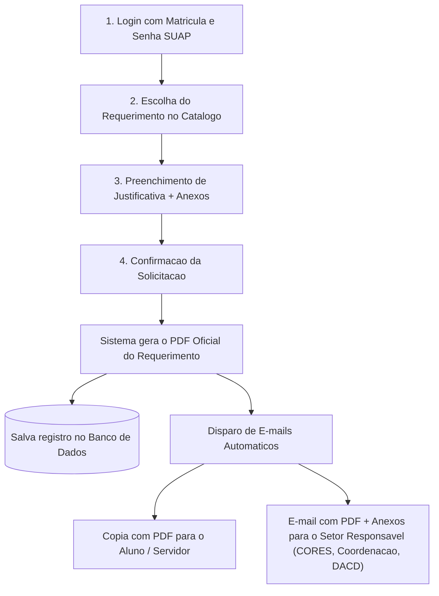

# 🏛️ SDP - Sistema de Protocolos & Requerimentos (IFBA - Campus Seabra)

<div align="center">


<p align="center">
  <b>Geração, Assinatura Digital e Despacho Automatizado de Requerimentos por E-mail</b><br>
  <i>Instituto Federal de Educação, Ciência e Tecnologia da Bahia (IFBA) — Campus Seabra</i>
</p>

</div>

---

## 📑 Sumário

- [Sobre o Projeto](#-sobre-o-projeto)
- [Como o Sistema Funciona (Fluxo Simplificado)](#-como-o-sistema-funciona-fluxo-simplificado)
- [Origem e Reaproveitamento (Fork)](#-origem-e-reaproveitamento-fork)
- [Arquitetura e Fluxo de Envio](#-arquitetura-e-fluxo-de-envio)
- [Tipos de Requerimentos e Destinos](#-tipos-de-requerimentos-e-destinos)
- [Tecnologias Utilizadas](#-tecnologias-utilizadas)
- [Estrutura do Repositório](#-estrutura-do-repositório)
- [Instalação e Configuração](#-instalação-e-configuração)
- [Documentação Detalhada](#-documentação-detalhada)
- [Licença](#-licença)

---

## 📌 Sobre o Projeto

O **SDP (Sistema de Protocolos)** é uma solução ágil e direta desenvolvida para o **IFBA Campus Seabra**. Seu objetivo principal é simplificar a solicitação de serviços acadêmicos e administrativos sem a necessidade de deslocamento físico ou preenchimento de papel.

O sistema permite que **alunos e servidores**:
1. Entrem com suas credenciais do **SUAP**.
2. Selecionem o **requerimento desejado** e preencham os campos necessários (com upload de anexos/comprovantes).
3. O sistema gere automaticamente o **PDF do Requerimento Oficial preenchido e assinado digitalmente**.
4. O SDP envie simultaneamente o PDF e os anexos para o **e-mail do solicitante** (comprovante) e para o **e-mail do setor responsável** (para processamento).

---

## ⚡ Como o Sistema Funciona (Fluxo Simplificado)



---

## 🔄 Origem e Reaproveitamento (Fork)

Este projeto foi construído baseada na integração do sistema anterior:

```
┌────────────────────────────────────────────────────────────────────────┐
│                        COMPOSIÇÃO DO PROJETO                           │
├──────────────────────────────────┬─────────────────────────────────────┤
│ ♻️ REAPROVEITADO DO SISTEMA BASE │ ✨ NOVO FLUXO DIRETO (SDP SEABRA)   │
├──────────────────────────────────┼─────────────────────────────────────┤
│ • Autenticação Híbrida (SUAP/JWT)│ • Catálogo de Requerimentos Rápidos │
│ • Login Local para Administradores│ • Formulários de Justificativa      │
│ • Web Scraping e Sincronização   │ • Geração Automática de PDF         │
│   (BrowserKit / Playwright)      │ • Disparo Imediato de E-mails       │
│ • Armazenamento seguro de Sessão │ • Anexo de comprovantes ao setor    │
└──────────────────────────────────┴─────────────────────────────────────┘
```

---

## 🏛️ Tipos de Requerimentos e Destinos (Campus Seabra)

O sistema roteia automaticamente a solicitação com base no tipo de requerimento:

| Categoria | Tipo de Requerimento | Anexos Comuns | Setor de Destino (E-mail) |
|---|---|---|---|
| **Acadêmico** | 2ª Chamada de Avaliação | Atestado / Justificativa | Coordenação de Curso / Docente |
| **Acadêmico** | Revisão de Prova / Nota | Cópia da avaliação | Coordenação de Curso |
| **Registro** | Trancamento / Cancelamento | Justificativa | CORAE (Registros Escolares) |
| **Registro** | Aproveitamento de Estudos / Dispensa | Ementa / Histórico | CORAE / Coordenação |
| **Frequência**| Justificativa de Faltas | Atestado médico | CAE / Registros Escolares |
| **Documento** | Declarações Específicas | — | CORAE |
| **Geral** | Requerimento Administrativo Diverso | Documentos pertinentes | Gabinete / Direção |

---

## 📐 Arquitetura e Fluxos

### 1. Autenticação Híbrida (SUAP + Local)
- **Alunos e Professores**: Autenticam via API v2 do SUAP (`/api/v2/autenticacao/token/`). O sistema obtém nome, matrícula, vínculo e e-mail institucional.
- **Admin Local**: Acesso via e-mail e senha cadastrados no sistema.
- **Fallback Local**: Caso o SUAP esteja temporariamente fora do ar, usuários já cadastrados conseguem autenticar via credencial local segura.

### 2. Geração de PDF e Notificação por E-mail
Ao submeter o formulário:
1. O backend compila os dados do usuário obtidos do SUAP + dados preenchidos no formulário.
2. É gerado um documento PDF padronizado com identificação visual do IFBA Seabra, código de autenticidade e carimbo de data/hora.
3. A fila de e-mails (`Illuminate\Support\Facades\Mail`) envia:
   - **Para o usuário**: Confirmação da solicitação com o PDF anexado.
   - **Para o setor**: Notificação formal com o requerimento PDF e todos os anexos enviados pelo requerente.

---

## 🛠️ Tecnologias Utilizadas

- **[PHP 8.3+](https://www.php.net/)** & **[Laravel 13.x](https://laravel.com/)**
- **[Symfony BrowserKit & DomCrawler](https://symfony.com/)** — Web scraping para sincronização de dados adicionais
- **[Playwright / TypeScript](https://playwright.dev/)** — Automação de extração do SUAP
- **[Blade](https://laravel.com/docs/blade)** + CSS moderno
- **[Laravel Mail](https://laravel.com/docs/mail)** — Envio de e-mails com anexos via SMTP
- **[Vite](https://vitejs.dev/)**

---

## 📂 Estrutura do Repositório

```text
SDP/
├── app/
│   ├── Http/
│   │   ├── Controllers/
│   │   │   ├── Auth/              # Login com SUAP e Local
│   │   │   ├── RequerimentoController.php # Criação, PDF e envio por e-mail
│   │   │   └── Admin/             # Gestão de setores e tipos de requerimentos
│   ├── Mail/                      # Classes Mailable (RequerimentoEnviado, etc.)
│   ├── Models/                    # Usuario, Requerimento, Setor, etc.
│   └── Services/
│       ├── SuapService.php        # Integração REST API SUAP
│       └── Suap/                  # Módulos de Scraping (BrowserKit)
├── docs/                          # Documentações técnicas
│   ├── fluxo-autenticacao.md      # Fluxo detalhado de login SUAP
│   ├── web-scraping-suap.md       # Documentação do motor de scraping
│   └── arquitetura-protocolos.md  # Especificação do fluxo simplificado de requerimentos
├── resources/
│   ├── views/
│   │   ├── requerimentos/         # Telas de seleção e formulário de requerimento
│   │   ├── pdf/                   # Template Blade do PDF oficial gerado
│   │   └── emails/                # Templates Blade de e-mails (aluno e setor)
├── routes/
│   └── web.php                    # Rotas do sistema
├── scraper/                       # Rotinas de scraping Playwright
└── vite.config.js
```

---

## 🚀 Instalação e Configuração

### 1. Pré-requisitos
- **PHP 8.3+**
- **Composer 2.x**
- **Node.js 20+**

### 2. Passo a Passo
```bash
# Clonar repositório
git clone https://github.com/ualcz/SDP.git
cd SDP

# Instalar dependências PHP
composer install

# Configurar ambiente
cp .env.example .env
php artisan key:generate

# Configurar banco de dados e SMTP de e-mail no .env
php artisan migrate --seed

# Instalar dependências de interface
npm install
```

### 3. Configuração de Envio de E-mail (.env)
Configure as credenciais SMTP no arquivo `.env`:
```env
MAIL_MAILER=smtp
MAIL_HOST=smtp.gmail.com # ou servidor institucional do IFBA
MAIL_PORT=587
MAIL_USERNAME=seu-email@ifba.edu.br
MAIL_PASSWORD=sua-senha-ou-app-password
MAIL_ENCRYPTION=tls
MAIL_FROM_ADDRESS="protocolos.seabra@ifba.edu.br"
MAIL_FROM_NAME="SDP - IFBA Seabra"
```

### 4. Executando em Desenvolvimento
```bash
composer run dev
```
Acesse em: `http://localhost:8000`

---

## 📖 Documentação Detalhada

- 🔐 [**Fluxo de Autenticação Híbrida**](./docs/fluxo-autenticacao.md)
- 🕷️ [**Web Scraping & Sincronização SUAP**](./docs/web-scraping-suap.md)
- 📄 [**Fluxo de Requerimentos, PDF e E-mails**](./docs/arquitetura-protocolos.md)

---

## 📄 Licença

Distribuído sob a licença [MIT](LICENSE).
