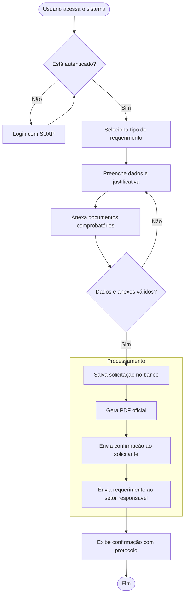

# 📋 Especificação Funcional: Fluxo de Requerimentos, PDF e E-mails (SDP Seabra)

Este documento detalha o fluxo simplificado e direto do **SDP (Sistema de Protocolos - IFBA Seabra)**, focado na seleção rápida de requerimentos, preenchimento, geração de PDF padronizado e despacho automático por e-mail para o usuário e para o setor responsável.

---

## 1. Proposta & Dinâmica do Sistema

O objetivo do sistema é ser direto e sem atrito:
1. **Identificação**: O aluno ou servidor loga com suas credenciais do SUAP.
2. **Seleção**: Escolhe o tipo de requerimento (ex: 2ª chamada de prova, trancamento, aproveitamento, declaração).
3. **Preenchimento e Anexos**: Informa justificativa, detalhes da solicitação e anexa arquivos comprobatórios (PDF/imagens).
4. **Assinatura & Geração de PDF**: O sistema gera um PDF oficial estruturado com os dados cadastrais do SUAP e a assinatura digital/carimbo temporal.
5. **Despacho Imediato**:
   - Dispara um e-mail de confirmação para o **aluno/servidor** com o PDF do requerimento.
   - Dispara um e-mail oficial para o **setor responsável** (CORAE, Coordenação, CAE, etc.) com o PDF e todos os anexos enviados.
   - Registra o protocolo no banco de dados para controle e histórico.

---

## 2. Fluxograma do Processo de Requerimento

Este fluxo foi reorganizado para facilitar a leitura: a autenticação fica separada da etapa de preenchimento; a validação do formulário aparece antes do registro; e a geração do PDF e os envios de e-mail ficam em um bloco único de processamento final.

---

## 3. Estrutura do PDF Gerado

O PDF gerado pelo sistema contém:
1. **Cabeçalho Institucional**: Brasão da República, Ministério da Educação, IFBA Campus Seabra.
2. **Dados do Requerente**: Nome completo, Matrícula, CPF/E-mail, Curso ou Cargo/Setor (extraídos do SUAP).
3. **Identificação do Requerimento**: Tipo de solicitação e número único do protocolo gerado.
4. **Corpo da Solicitação**: Justificativa e detalhamento digitados pelo usuário.
5. **Assinatura Digital Institucional**: Carimbo de data/hora, endereço IP e identificação de submissão autenticada via SUAP.