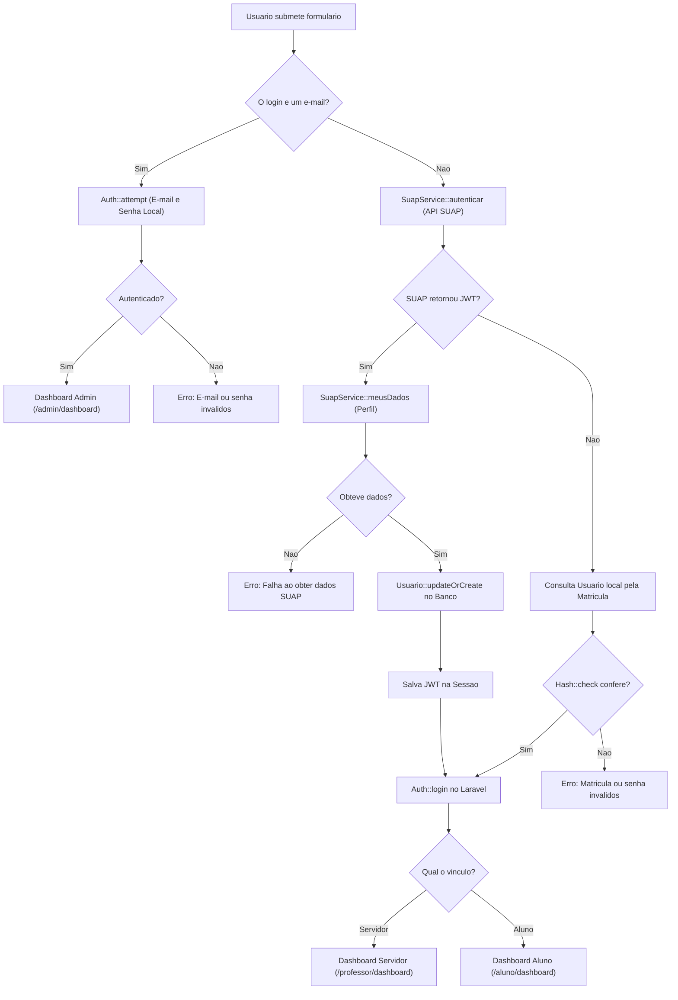

# 🔐 Documentação Técnica: Fluxo de Autenticação Híbrida

Esta seção detalha o funcionamento da camada de autenticação do **SDP (Sistema de Protocolos - IFBA Seabra)**, implementada em [`app/Http/Controllers/Auth/LoginController.php`](../app/Http/Controllers/Auth/LoginController.php) e [`app/Services/SuapService.php`](../app/Services/SuapService.php).

---

## 1. Visão Geral

O sistema implementa uma estratégia de login **híbrida e unificada**, capaz de atender três perfis com o mesmo formulário:

1. **Administradores do Sistema**: Acessam via e-mail e senha cadastrados diretamente no banco de dados local.
2. **Alunos e Professores/Servidores**: Acessam utilizando a **Matrícula** e a **Senha institucional do SUAP**.
3. **Modo Resiliente (Fallback Local)**: Permite login mesmo em caso de indisponibilidade da API do SUAP, caso o usuário já tenha efetuado login anteriormente.

---

## 2. Diagrama de Decisão de Login



---

## 3. Componentes da Autenticação

### 3.1. `SuapService` ([`app/Services/SuapService.php`](../app/Services/SuapService.php))
Responsável pela comunicação HTTP com a API REST v2 do SUAP:
- **`autenticar($matricula, $senha)`**: Envia uma requisição `POST` para `https://suap.ifba.edu.br/api/v2/autenticacao/token/` com timeout de 10 segundos. Retorna a string JWT em caso de sucesso ou `null` em caso de erro.
- **`meusDados($jwt)`**: Faz uma requisição `GET` com o header `Authorization: JWT <token>` para `https://suap.ifba.edu.br/api/v2/minhas-informacoes/meus-dados/`, obtendo dados como nome completo, nome usual, e-mail institucional e tipo de vínculo (`Aluno` ou `Servidor`).

### 3.2. Persistência de Dados e Segurança
Quando o login via SUAP é validado com sucesso:
- O registro na tabela `usuarios` é sincronizado via `updateOrCreate`:
  - `matricula`: Identificador único institucional.
  - `nome`: Nome usual ou formatado do vínculo.
  - `email`: E-mail oficial ou formato técnico `<matricula>@ifba.edu.br`.
  - `password`: Armazenado usando `Hash::make($password)` para viabilizar o fallback local.
  - `senha_suap`: Criptografada com `Crypt::encryptString($password)` para ser utilizada com segurança pelos scrapers internos quando necessário.
  - `role`: Atribuído como `'professor'` se `tipo_vinculo === 'Servidor'` ou `'aluno'` por padrão.

### 3.3. Armazenamento do JWT na Sessão
```php
session([
    'suap_jwt' => $jwt,
]);
```
Isso permite que qualquer serviço subsequente faça requisições autenticadas em nome do usuário logado sem solicitar a senha novamente.

---

## 4. Controle de Acesso (Middlewares)

O sistema utiliza middlewares para segregar os painéis:
- `auth`: Garante que a sessão está autenticada.
- `role:admin`: Restringe acesso a rotas administrativas (`/admin/*`).
- `role:professor`: Acesso a rotas de servidores e docentes.
- `role:aluno`: Acesso ao painel do estudante.
