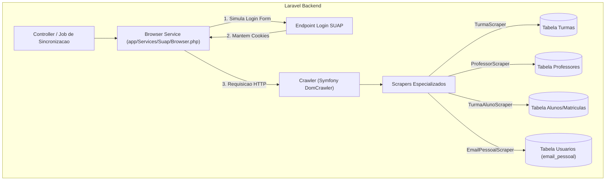

# 🕷️ Documentação Técnica: Web Scraping e Sincronização SUAP

Esta seção detalha o mecanismo de **Web Scraping** integrado ao SDP, utilizado para extrair dados complementares do ecossistema SUAP que não estão expostos na API REST pública.

---

## 1. Visão Geral

A camada de scraping opera em dois níveis:

1. **Mecanismo Síncrono em PHP (`app/Services/Suap/`)**: Baseado em `Symfony\Component\BrowserKit` e `Symfony\Component\DomCrawler`, ideal para extração rápida e sem dependência de interface gráfica no backend.
2. **Mecanismo Automatizado em Node.js (`scraper/`)**: Baseado em `Playwright` e `TypeScript`, utilizado para fluxos complexos, downloads ou interações dinâmicas ricas.

---

## 2. Arquitetura do Motor PHP (Symfony BrowserKit)

