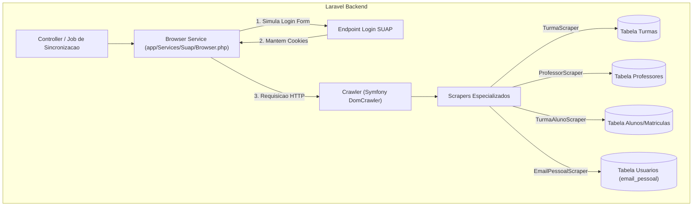

# 🕷️ Documentação Técnica: Web Scraping e Sincronização SUAP

Esta seção detalha o mecanismo de **Web Scraping** integrado ao SDP, utilizado para extrair dados complementares do ecossistema SUAP que não estão expostos na API REST pública.

---

## 1. Visão Geral

A camada de scraping opera em dois níveis:

1. **Mecanismo Síncrono em PHP (`app/Services/Suap/`)**: Baseado em `Symfony\Component\BrowserKit` e `Symfony\Component\DomCrawler`, ideal para extração rápida e sem dependência de interface gráfica no backend.
2. **Mecanismo Automatizado em Node.js (`scraper/`)**: Baseado em `Playwright` e `TypeScript`, utilizado para fluxos complexos, downloads ou interações dinâmicas ricas.

---

## 2. Arquitetura do Motor PHP (Symfony BrowserKit)



### 2.1. O Cliente de Navegação (`Browser.php`)
Localizado em [`app/Services/Suap/Browser.php`](../app/Services/Suap/Browser.php):
- Instancia `HttpBrowser` com `HttpClient` configurado com `User-Agent` moderno.
- Executa a submissão de formulário no endpoint `/accounts/login/` com as credenciais do usuário.
- Mantém o estado da sessão (cookies) para as requisições subsequentes via `$browser->get($url)`.

### 2.2. Scrapers Especializados

| Scraper | Arquivo | Responsabilidade |
|---|---|---|
| `TurmaScraper` | [`TurmaScraper.php`](../app/Services/Suap/TurmaScraper.php) | Extrai código da disciplina, nome da turma e ID da sala virtual a partir das tabelas HTML do SUAP. |
| `TurmaAlunoScraper` | [`TurmaAlunoScraper.php`](../app/Services/Suap/TurmaAlunoScraper.php) | Extrai relação de matrículas de estudantes vinculados a turmas específicas. |
| `ProfessorScraper` | [`ProfessorScraper.php`](../app/Services/Suap/ProfessorScraper.php) | Extrai dados de docentes, lotação e departamentos. |
| `EmailPessoalScraper`| [`EmailPessoalScraper.php`](../app/Services/Suap/EmailPessoalScraper.php) | Obtém o e-mail pessoal de contato do perfil do usuário para notificações de protocolos. |

---

## 3. Motor Playwright (`scraper/`)

Para testes de automação e rotinas em background que requerem execução de JavaScript ou manipulação complexa do DOM:

### 3.1. Estrutura
- `scraper/src/login.ts`: Rotina de teste de autenticação visual com Playwright Chromium.
- `scraper/src/sync.ts`: Rotinas de sincronização em lote.

### 3.2. Execução
```bash
# Entrar no diretório do scraper
cd scraper

# Executar rotina de teste de login
npm run login

# Executar rotina de sincronização
npm run sync
```

---

## 4. Boas Práticas e Segurança

- **Credenciais**: As senhas são decifradas apenas em tempo de execução via `Crypt::decryptString()` e nunca registradas em logs ou arquivos temporários.
- **Respeito aos Limites do Servidor**: As requisições de raspagem devem ser paginadas e espaçadas (rate limiting) para não sobrecarregar os servidores do SUAP IFBA.
- **Tratamento de Exceções**: Em caso de falha de conexão ou alteração no layout HTML do SUAP, os scrapers contam com tratamento de erros para não travar a aplicação principal.
